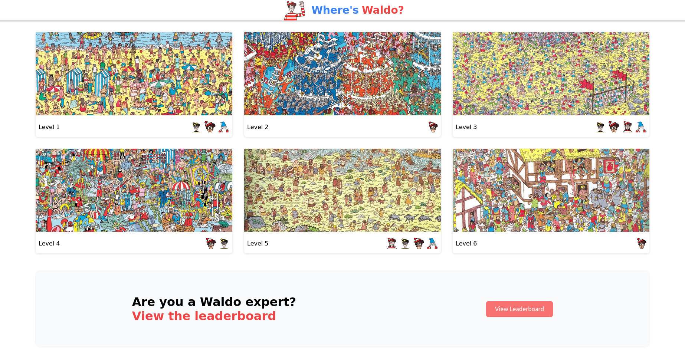

# Where's Waldo Game

• Uses Firebase to keep track of score (and leaderboard).  
• Uses advanced React to handle correct tagging of characters.  
• Built using custom CSS.

## How I worked on this project

My goal was to build a Where's Waldo? game.

- I worked with tasks defined on [TOP](https://www.theodinproject.com/lessons/node-path-javascript-where-s-waldo-a-photo-tagging-app)
- I used feature branches.

## How to navigate this project

- [App's top-level component which handles most of the Firebase interactions:](./src/App.js)
- [Component to handle playing:](./src/components/GameLevel.js)

## Why I built the project this way

- My plan is to become a full-stack developer eventually. But for the beginning I focus on the
  frontend. That's why I decided to use an existing API (Firebase) rather to create a custom server. I have
  basic backend knowledge as well (You can checkout other projects of mine).
- I used global css classes because I didn't know about CSS modules and styled components at that moment.

## If I had more time I would change this

- Add a "X" mark where the player already clicked.
- Add a "Start" button before the timer starts for the game.

## Available Scripts

In the project directory, you can run:

### `npm start`

Runs the app in the development mode.\
Open [http://localhost:3000](http://localhost:3000) to view it in your browser.

The page will reload when you make changes.\
You may also see any lint errors in the console.

### `npm test`

Launches the test runner in the interactive watch mode.\
See the section about [running tests](https://facebook.github.io/create-react-app/docs/running-tests) for more information.

### `npm run build`

Builds the app for production to the `build` folder.\
It correctly bundles React in production mode and optimizes the build for the best performance.

The build is minified and the filenames include the hashes.\
Your app is ready to be deployed!

See the section about [deployment](https://facebook.github.io/create-react-app/docs/deployment) for more information.
